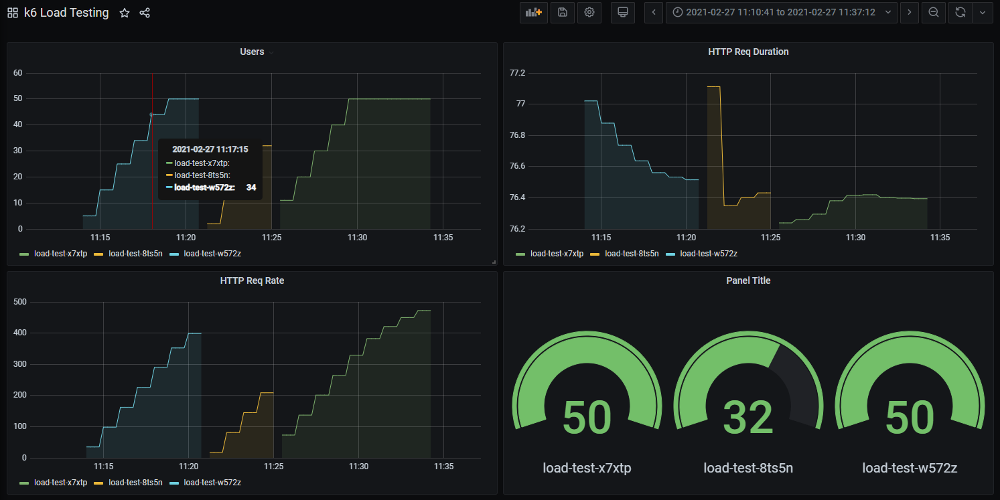

# k6 Prometheus Exporter

This is a attempt to provide data from the [k6 load testing tool](https://k6.io/) to Prometheus in order to display and visualize it in Grafana

It is written in Go and acts as proxy for the k6 REST API, exposing the results over HTTP in the standard Prometheus exposition format, at the standard `/metrics` endpoint

Goals:

- See if it was possible using the k6 REST API
- Report on k6 load tests without needing to push huge volumes of data into a CSV or InfluxDB


# Getting Started

## Deploying to Kubernetes

See [example-job.yaml](deploy/example-job.yaml) for an example of how to deploy k6-prometheus-exporter as a sidecar alongside a k6 load test, running as a Kubernetes job.

You can also run it as a standalone pod external from k6, this requires that the k6 REST API (port 6565 by default) is exposed as a service. See [deploy/standalone](./deploy/standalone) for an example of doing this

## Local Development

- If you wish to build or run locally, use `make build` or `make run`
- If you wish to build the Docker image, use `make image` or `make push`. When calling make set **IMAGE_REG**, **IMAGE_REPO** and **IMAGE_TAG** as you wish

## Running as container

```bash
docker run ghcr.io/benc-uk/k6-prometheus-exporter:latest
```

# Screenshots

Example of some of the data shown in a Grafana dashboard



# Configuration

Details of any configuration files, environmental variables, command line parameters, etc.

For services
| Setting / Variable | Purpose | Default |
| ------------------ | ------------------------------------------- | ------- |
| METRICS*PORT | Port the server will listen on. | 2112 |
| K6_API_ENDPOINT | Some very important setting. \*\*\_Required*\*\* | _None_ |

# Repository Structure

A brief description of the top-level directories of this project is as follows:

```c
/api        - Details of the API specification & docs
/build      - Build configuration e.g. Dockerfiles
/charts     - Helm charts
/deploy     - Deployment and infrastructure as code, inc Kubernetes
/scripts    - Bash and other supporting scripts
/src        - Source code
/test       - Testing, mock data and API + load tests
```

# Known Issues

List any known bugs or gotchas.

# Change Log

See [complete change log](./CHANGELOG.md)

# License

This project uses the MIT software license. See [full license file](./LICENSE)

# Acknowledgements

Optional. Put acknowledgements and credits here, if any
